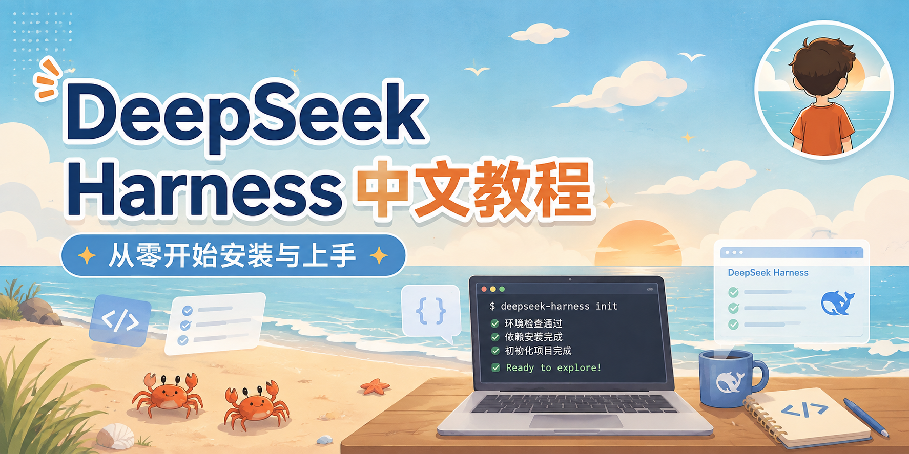

  

<h1 align="center">DeepSeek Harness 教程</h1>

  <b>一份从源码出发、按模块组织的中文教程</b> 
  带你从「<code>dsh</code> 是什么」一路走到「如何在 <code>dsh</code> 上写出自己的插件」

  <a href="00-basics.md"><b>🚀 零基础导读</b></a> ·
  <a href="index.md"><b>📚 完整目录</b></a> ·
  <a href="appendix-glossary.md"><b>📖 术语速查</b></a> ·
  <a href="https://github.com/deepseek-ai/deepseek-harness"><b>🔗 官方仓库</b></a>

---

## 这是什么

本仓库是一份系统性的 **DeepSeek Harness（`dsh`）教程**，用中文编写、按「教学顺序」组织。每一章都对应官方仓库里的一组真实包（`packages/<group>/<pkg>/`），并标注关键源码与类型定义的位置，方便你随时回到源码核对。

> 教程用中文编写；代码标识符、类型名、事件名、`ctx` 键等保持英文原文，首次出现时给出中文说明。

## 第一次接触？从这里开始

如果你对「agent / 智能体 / 大模型」这些词还不熟，**先读 [零基础导读](00-basics.md)** —— 它用大白话讲清「agent 是什么、大脑和手怎么配合、dsh 为什么一切皆插件」，几分钟读完，后面 14 章就都能跟上了。

## 这份教程适合谁

- 想读懂 `dsh` 源码、理清其模块边界的开发者。
- 想给 `dsh` 加工具、加能力、加模型适配器、加 Web UI 节点的插件作者。
- 想用 `dsh` 组装自己的 agent 应用（CLI / Web / ACP / JSON-RPC）的集成者。

## 前置知识

- 会写现代 JavaScript / TypeScript（本教程不重讲语法）。
- 装了 Node.js（要求 `^22.19 || >=24`）与 pnpm。
- 对「大语言模型调用 + 工具调用」的基本流程有概念即可（没有也不怕，[零基础导读](00-basics.md)会补齐）。

## 章节地图

按顺序读即可——每一章都建立在前一章的概念之上。第 3 章是 Cordis 框架速览，是理解后续所有章节的地基。

| 章节 | 内容 | 对应的仓库模块 |
|---|---|---|
| [零基础导读](00-basics.md) | 用大白话讲清 agent、大脑/手、插件、接缝——第一次接触必读 | — |
| [第 1 章：总体架构](01-overview.md) | 一切皆插件、profile/bundle、能力接缝、轮次流转、扩展点总览 | `vendor/`、`packages/bundle/`、`packages/boot/` |
| [第 2 章：环境与运行](02-getting-started.md) | 安装、从源码跑、profile、`--dump-config`、目录结构 | 仓库根、`apps/cli` |
| [第 3 章：Cordis 框架基础](03-cordis.md) | 插件、Context、服务、事件、effect/on、配置与组合 | `vendor/cordis` |
| [第 4 章：核心与 Agent 循环](04-core-loop.md) | session / system-prompt / tools / agent / agent-loop，turn/step 流程 | `packages/core/` |
| [第 5 章：LLM 能力](05-llm.md) | Message/StreamChunk、LlmAdapter 接缝、DeepSeek 提供方、token-meter | `packages/llm/` |
| [第 6 章：执行类能力](06-execution-capabilities.md) | shell、subprocess、terminal、code-runtime、sandbox、e2b | `packages/shell/` 等 |
| [第 7 章：工具与数据类能力](07-tool-capabilities.md) | fs、lsp、skill、web、mcp、attachment、spill | `packages/fs/` 等 |
| [第 8 章：编排](08-orchestration.md) | subagent、workflow、todo、plan、goal、schedule、jobs、compaction、guard | `packages/subagent/` 等 |
| [第 9 章：上下文与人类协作](09-interaction.md) | context、commands、approval、permission-presets、ask-user、feedback | `packages/context/`、`packages/interaction/` |
| [第 10 章：持久化与数据平面](10-data-plane.md) | session 持久化、投影、查询、storage、workspace、settings、credentials | `packages/session/` 等 |
| [第 11 章：启动、组合与预设](11-composition.md) | app-boot、bundle、preset、extensions（自修改） | `packages/boot/`、`packages/bundle/` 等 |
| [第 12 章：接入与对外接口](12-integration.md) | api/typert 网关、sdk、acp、hooks、Web GUI（host/client） | `packages/api/`、`packages/sdk/` 等 |
| [第 13 章：如何扩展 dsh](13-extending.md) | 加工具、加提供方、加包、加 LLM 适配器、加 Chat 节点 | `docs/cookbook/` |
| [第 14 章：开发、测试与文档](14-development.md) | 开发工作流、测试策略、文档规范、常用命令 | `scripts/`、`docs/` |
| [附录：术语速查](appendix-glossary.md) | turn/step、seam、scope、goal 等规范术语 | `docs/glossary.md` |

## 官方文档索引

本教程是「教学顺序」的路线图；官方文档是「查找」用的权威参考。需要精确类型、事件签名或配置字段时，优先查官方 [deepseek-ai/deepseek-harness](https://github.com/deepseek-ai/deepseek-harness) 仓库。完整索引见 [index.md](index.md)。

> ⚠️ 注意：`dsh` 目前处于**开发者预览**阶段，接口会以破坏兼容的方式快速演进。本教程以官方仓库当前源码为准。

## 许可证

[MIT](LICENSE)
